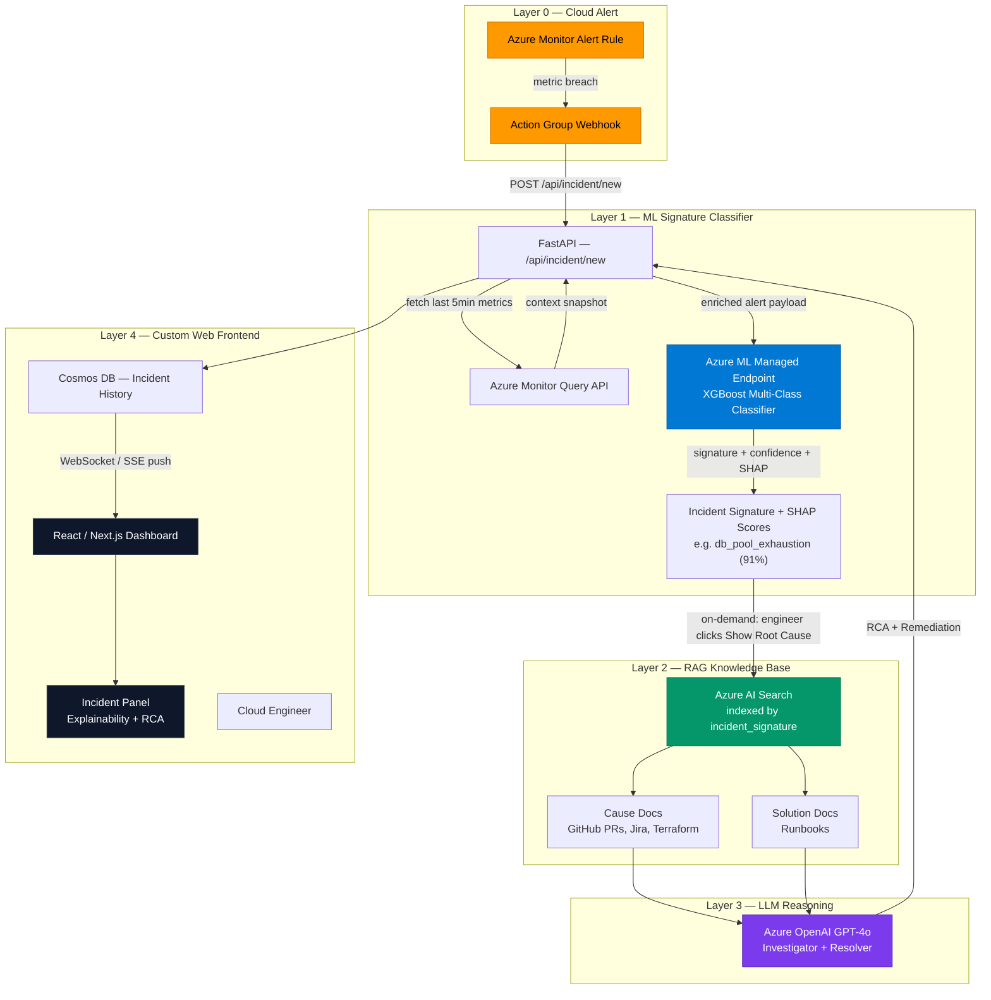
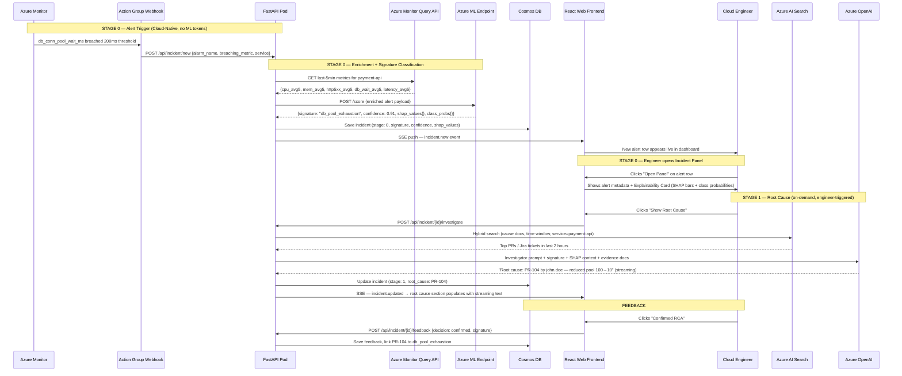

# AI Incident RCA Engine — System Architecture (v3)

> **Purpose**: This document details the complete system architecture for the **Contextual Incident Root Cause Analysis (RCA) Engine** — an AI platform that takes a cloud-native alert as its entry point, classifies it into a known incident signature, retrieves the correlated root cause and remediation from a curated knowledge base, and surfaces everything through a **custom web frontend** with a built-in LLM chat interface.
>
> **Key Design Changes (v3)**:
> - **v2 change**: Anomaly *detection* is entirely delegated to **Azure Monitor Alert Rules**. The ML model classifies *what kind* of incident this is — a multi-class signature classification task.
> - **v3 change**: The Slack/Teams ChatOps output is replaced by a **custom web frontend** (React/Next.js). Engineers interact with alerts, view model explainability details, trigger root cause analysis, and view remediation steps — all within a single incident panel in the web UI. *(Note: An LLM chat interface is planned for a future iteration).*

---

## Table of Contents

1. [System Overview](#1-system-overview)
2. [Architecture: Before vs. After (v1 → v3)](#2-architecture-before-vs-after)
3. [Data Architecture](#3-data-architecture)
4. [Layer 0 — Cloud-Native Alert Trigger (Azure Monitor)](#4-layer-0--cloud-native-alert-trigger)
5. [Layer 1 — ML Signature Classifier](#5-layer-1--ml-signature-classifier)
6. [Layer 2 — RAG Knowledge Base](#6-layer-2--rag-knowledge-base)
7. [Layer 3 — LLM Reasoning Engine](#7-layer-3--llm-reasoning-engine)
8. [Layer 4 — Custom Web Frontend](#8-layer-4--custom-web-frontend)
9. [Authentication Strategy](#9-authentication-strategy)
10. [End-to-End Flow (Sequence Diagram)](#10-end-to-end-flow)
11. [Infrastructure Changes Required](#11-infrastructure-changes-required)
12. [Repository & CI/CD Adaptations](#12-repository--cicd-adaptations)
13. [Cost & Token Optimization Strategy](#13-cost--token-optimization-strategy)

---

## 1. System Overview

### What the System Does

The RCA Engine is a **signal-to-diagnosis** pipeline. It does NOT attempt to detect anomalies — the cloud monitoring platform already does that. Instead, once an alert fires, the system immediately answers two questions:

> **"What *type* of incident is this?"** → answered by the ML Signature Classifier  
> **"What caused it and how do I fix it?"** → answered by the RAG + LLM pipeline

| Layer | Technology | Role | Analogy |
|---|---|---|---|
| **Layer 0 — The Alarm** | Azure Monitor Alert Rule | Detects metric threshold breach and fires a webhook to trigger the pipeline | The fire alarm on the wall |
| **Layer 1 — The Diagnostician** | XGBoost Multi-Class Classifier (Azure ML) | Reads the alert payload + context metrics and classifies it into a known **incident signature** | A doctor matching symptoms to a known diagnosis |
| **Layer 2 — The Evidence Room** | Azure AI Search (RAG Vector DB) | Retrieves recent PRs, Jira tickets, Terraform diffs, and Runbooks *matching the classified signature* | A filing cabinet of evidence, pre-organized by incident type |
| **Layer 3 — The Analyst** | Azure OpenAI (GPT-4o) | Synthesizes the signature + evidence into a human-readable RCA report and remediation plan | An experienced SRE reviewing the case file |
| **Layer 4 — The Dashboard** | React / Next.js Web App | Displays live alerts, model explainability, and on-demand RCA — all within a single incident panel (chat capabilities planned for the future) | An SRE war room with every tool on one screen |

### What "Incident Signature" Means

An **incident signature** is a named, pre-defined class of infrastructure failure pattern. Each class has a recognizable combination of metric behaviors:

| Signature Class | Key Metrics Pattern | Example |
|---|---|---|
| `db_pool_exhaustion` | `db_conn_pool_wait_ms` ↑↑, `request_latency_p99` ↑ | Payment API DB connections spike |
| `memory_leak_progressive` | `memory_percent` slowly ↑↑ over hours | Long-running worker accumulates heap |
| `cpu_saturation_burst` | `cpu_percent` → 99%, `http_5xx_rate` ↑ | Traffic spike overwhelms pod |
| `cascade_failure` | All metrics spike simultaneously | Downstream dependency taken offline |
| `network_partition` | `http_5xx_rate` ↑↑, latency ↑↑, CPU normal | ACL/firewall change blocked traffic |
| `normal_noisy` | Mild transient spikes, no sustained breach | False positive from a deployment restart |

> [!IMPORTANT]
> **Classification ≠ Detection.** The model does not decide whether something is wrong — the CloudWatch/Azure Monitor alarm already made that call. The model only decides *which named signature* best fits the incoming alert context. This is a supervised multi-class classification problem with clean, human-curated labels.

### The 3-Stage Interactive Flow

```
┌─────────────────────────────────────────────────────────────────────────────┐
│  ALERT DASHBOARD — Incident List                                             │
│  ┌──────────────────────────────────────────────────────────────────────┐   │
│  │ 🔴 [P1] payment-api — db_conn_pool_wait_ms > 200ms (342ms) — 2m ago  │   │
│  │     Signature: db_pool_exhaustion   Confidence: 91%   [ Open Panel ] │   │
│  └──────────────────────────────────────────────────────────────────────┘   │
│  ┌──────────────────────────────────────────────────────────────────────┐   │
│  │ 🟡 [P2] auth-service — memory_percent > 80% (88%) — 15m ago          │   │
│  │     Signature: memory_leak_progressive   Confidence: 78%             │   │
│  └──────────────────────────────────────────────────────────────────────┘   │
└─────────────────────────────────────────────────────────────────────────────┘
          ↓ engineer clicks "Open Panel"
┌─────────────────────────────────────────────────────────────────────────────┐
│  INCIDENT PANEL — INC-001 / payment-api                                      │
│  ─────────────────────────────────────────────────────────────────────────  │
│  📍 Signature: db_pool_exhaustion       🎯 Confidence: 91%                  │
│  ─────────────────────────────────────────────────────────────────────────  │
│  MODEL EXPLAINABILITY                                                        │
│  ┌──────────────────────────────────────────────────────────────────────┐   │
│  │  Top features driving this classification:                            │   │
│  │  ① db_wait_avg5 = 342ms         ████████████████░░░░  +0.82 SHAP    │   │
│  │  ② breaching_metric = db_wait   ████████████░░░░░░░░  +0.61 SHAP    │   │
│  │  ③ db_wait_to_cpu_ratio = 28.5  ████████░░░░░░░░░░░░  +0.44 SHAP    │   │
│  │  ④ cpu_avg5 = 12%               ██░░░░░░░░░░░░░░░░░░  -0.12 SHAP    │   │
│  │                                                                       │   │
│  │  Other class probabilities:                                           │   │
│  │  cascade_failure 3% | cpu_saturation_burst 1% | network_partition 1% │   │
│  └──────────────────────────────────────────────────────────────────────┘   │
│  [ 🔍 Show Root Cause ]   [ 🔕 Mark as Maintenance ]                        │
└─────────────────────────────────────────────────────────────────────────────┘
          ↓ engineer clicks "Show Root Cause"
┌─────────────────────────────────────────────────────────────────────────────┐
│  INCIDENT PANEL — INC-001  [Alert ✓] [Root Cause ✓]                        │
│  ─────────────────────────────────────────────────────────────────────────  │
│  📋 ROOT CAUSE ANALYSIS                                                      │
│  Most likely cause: PR #104 by john.doe (merged 12 min ago)                 │
│  Change: Reduced DB max pool size from 100 → 10 in config/db.yml            │
│  Correlation: Pool wait spiked within 2 minutes of the merge.               │
│                                                                             │
│  Runbook identified: RB-012 — DB Pool Exhaustion Recovery                   │
│  Remediation options:                                                       │
│    Option A: Revert PR-104  →  git revert <sha> && git push                 │
│    Option B: kubectl set env deployment/payment-api DB_MAX_POOL=50          │
│    Option C: kubectl rollout restart deployment/payment-api                 │
│  ─────────────────────────────────────────────────────────────────────────  │
│  [ ✅ Confirmed RCA ]    [ ❌ False Alarm ]    [ ✏️ Correct Signature ]      │
└─────────────────────────────────────────────────────────────────────────────┘
```

> [!TIP]
> **Why not detect anomalies ourselves?** Azure Monitor is purpose-built, highly tuned, and requires zero ML maintenance overhead. Rebuilding detection from scratch would be reinventing the wheel at lower quality. Our value-add is the *classification*, *diagnosis*, and *conversational follow-up* that happens *after* the alarm fires — tasks that cloud monitoring platforms cannot do natively.

---

## 2. Architecture: Before vs. After

### What Changed in v2

| Aspect | v1 (Custom Anomaly Detection) | v2 (CloudWatch-Triggered Classification) |
|---|---|---|
| **Who detects anomalies?** | Custom XGBoost binary classifier, polling every 1 min | **CloudWatch / Azure Monitor** — native, threshold-based, no ML required |
| **ML model task** | Binary: `is_anomaly` (0/1) | **Multi-class**: `incident_signature` (6 classes) |
| **ML model trigger** | Continuous AKS CronJob polling every 1 minute | **Event-driven**: Only invoked when a cloud alert fires |
| **ML inputs** | Raw telemetry (cpu, mem, http_5xx, latency, db_wait) | Alert payload payload + enriched context metrics snapshot |
| **ML output** | `is_anomaly`, `anomaly_score` | `incident_signature`, `confidence`, `class_probabilities[6]` |
| **Training labels** | `is_anomaly` binary column | `incident_signature` named class column (6 values) |
| **Training data complexity** | Simple binary labeling (0/1) | Richer: curated examples of each named failure pattern |
| **Infrastructure overhead** | Requires always-on CronJob pod | No CronJob needed — alert webhook is the trigger |
| **Alert fatigue risk** | Model can produce false positives | Cloud monitor alarms are pre-tuned per service SLA |

### Architecture Diagram



---

## 3. Data Architecture

### 3.1 Telemetry Snapshot (Alert Payload + Context)

When CloudWatch fires an alarm, it sends a payload with the breaching metric. The FastAPI `/api/incident/new` handler **enriches** this with a context snapshot from the monitoring API (last 5 minutes of all related metrics). This enriched snapshot is what the ML classifier receives.

| Field | Source | Description |
|---|---|---|
| `alert_id` | CloudWatch / Azure Monitor | Unique alarm identifier |
| `alarm_name` | CloudWatch / Azure Monitor | e.g. `payment-api-db-pool-wait-high` |
| `breaching_metric` | CloudWatch / Azure Monitor | e.g. `db_conn_pool_wait_ms = 342ms` |
| `service_name` | Alarm tag / SNS metadata | e.g. `payment-api` |
| `alert_severity` | Alarm config | `P1 / P2 / P3` |
| `cpu_percent_avg5` | Azure Monitor API / CloudWatch GetMetricData | Rolling 5-min average |
| `memory_percent_avg5` | Azure Monitor API / CloudWatch GetMetricData | Rolling 5-min average |
| `http_5xx_rate_avg5` | Azure Monitor API / CloudWatch GetMetricData | Rolling 5-min average |
| `db_conn_pool_wait_avg5` | Azure Monitor API / CloudWatch GetMetricData | Rolling 5-min average |
| `request_latency_p99_avg5` | Azure Monitor API / CloudWatch GetMetricData | Rolling 5-min average |
| `alert_timestamp` | CloudWatch / Azure Monitor | ISO 8601 timestamp |

> [!NOTE]
> The FastAPI handler directly calls the CloudWatch / Azure Monitor API to populate these `*_avg5` fields immediately after receiving the webhook alert. This happens identically in both the POC and Production environments.

### 3.2 Training Dataset (`telemetry_labeled.csv`)

This is the labeled dataset used to train the signature classifier. Each row represents a **historical incident snapshot** with a human-verified signature label.

| Column | Type | Description | Example Values |
|---|---|---|---|
| `timestamp` | datetime | When the alert fired | `2026-03-15T14:22:00Z` |
| `service_name` | string | Affected service | `payment-api`, `auth-service` |
| `breaching_metric` | string | Primary metric that breached | `db_conn_pool_wait_ms` |
| `cpu_percent_avg5` | float | 5-min avg CPU | 15–99% |
| `memory_percent_avg5` | float | 5-min avg Memory | 40–95% |
| `http_5xx_rate_avg5` | float | 5-min avg 5xx error rate | 0–50 |
| `db_conn_pool_wait_avg5` | float | 5-min avg DB wait | 1–450ms |
| `request_latency_p99_avg5` | float | 5-min avg P99 latency | 45–2500ms |
| `incident_signature` | **string (label)** | Human-verified incident class | `db_pool_exhaustion`, `memory_leak_progressive`, `cpu_saturation_burst`, `cascade_failure`, `network_partition`, `normal_noisy` |
| `incident_id` | string | Links row to RAG evidence docs | `INC-001`, `INC-002`, … |

> [!IMPORTANT]
> The `incident_signature` column is the **classification target**. Labels are curated by the SRE team based on historical post-mortems, runbooks, and resolved incidents. This is the key MLOps investment: building and maintaining a high-quality labeled dataset over time.

### 3.3 Knowledge Base (`rag_context.json`)

Each document in the RAG store has a new field: `incident_signature`. This enables **filtered retrieval** — when the classifier returns `db_pool_exhaustion`, the RAG search immediately narrows to documents tagged with that signature.

```json
{
  "id": "uuid",
  "content": "PR #104: Optimize DB connections...",
  "code_diff": "- max_connections: 100\n+ max_connections: 10", 
  "embedding": [1536],
  "doc_type": "github_pr | runbook | jira_ticket | terraform_pr",
  "incident_signature": "unknown | db_pool_exhaustion", 
  "service_affected": "payment-api",
  "author": "john.doe",
  "timestamp": "2026-04-04T06:18:44",
  "incident_id": "INC-001"
}
```

> [!TIP]
> The `incident_signature` field is the most important addition in v2. It allows the RAG search to skip semantic similarity entirely for the first filter, dramatically improving retrieval precision: the system goes straight to "show me all PRs tagged `db_pool_exhaustion` in the last 2 hours" before applying vector similarity.

### 3.4 Cosmos DB Incident Document Schema

```json
{
  "incident_id": "INC-001",
  "alert_source": "cloudwatch | azure_monitor",
  "alarm_name": "payment-api-db-pool-wait-high",
  "breaching_metric": "db_conn_pool_wait_ms = 342ms",
  "service": "payment-api",
  "alert_severity": "P1",
  "detected_at": "2026-04-04T06:48:44Z",
  "classified_signature": "db_pool_exhaustion",
  "signature_confidence": 0.91,
  "class_probabilities": {
    "db_pool_exhaustion": 0.91,
    "memory_leak_progressive": 0.04,
    "cascade_failure": 0.03,
    "cpu_saturation_burst": 0.01,
    "network_partition": 0.01,
    "normal_noisy": 0.0
  },
  "stage_reached": "stage_2_solution",
  "root_cause_identified": "PR-104",
  "engineer_feedback": "confirmed_rca",
  "conversation": [
    { "stage": 0, "type": "alert", "content": "CloudWatch: DB wait > 200ms on payment-api" },
    { "stage": 0, "type": "classification", "content": "Signature: db_pool_exhaustion (91% confidence)" },
    { "stage": 1, "type": "investigation", "content": "PR-104 by john.doe..." },
    { "stage": 2, "type": "solution", "content": "Runbook RB-012 recommends..." }
  ],
  "resolved_at": "2026-04-04T07:02:00Z",
  "tokens_consumed": { "stage_1": 450, "stage_2": 820 }
}
```

---

## 4. Layer 0 — Cloud-Native Alert Trigger

### 4.1 How CloudWatch / Azure Monitor Fires the Pipeline

The system is **entirely event-driven**. There is no polling, no CronJob, no continuous ML inference loop. The pipeline only activates when the cloud provider's native alerting decides a threshold has been breached.

```
┌──────────────────────────────────────────────────────────────────────┐
│  CLOUD MONITORING LAYER (No custom code, managed by ops team)        │
│                                                                       │
│  CloudWatch Metric Alarm:                                             │
│    AlarmName: payment-api-db-pool-wait-high                           │
│    Metric: db_conn_pool_wait_ms                                       │
│    Threshold: > 200ms for 3 consecutive 1-minute datapoints          │
│    Action: → Publish to SNS Topic: rca-engine-alerts                 │
│                                                                       │
│  Azure Monitor Alert Rule (equivalent):                               │
│    Signal: db_conn_pool_wait_ms                                       │
│    Condition: > 200ms for 3 minutes                                   │
│    Action Group: → POST webhook to FastAPI /api/incident/new          │
└──────────────────────────────────────────────────────────────────────┘
         │
         │  Webhook / SNS → EventBridge → API Gateway → FastAPI
         ▼
┌──────────────────────────────────────────────────────────────────────┐
│  FastAPI /api/incident/new                                            │
│                                                                       │
│  1. Parse the alert payload                                           │
│  2. Fetch context metrics from Monitoring API (last 5 min avg)       │
│  3. POST enriched payload → Azure ML Endpoint (classifier)           │
│  4. Receive: { signature: "db_pool_exhaustion", confidence: 0.91 }   │
│  5. Save incident to Cosmos DB (stage 0)                             │
│  6. Send Stage 0 alert to Slack/Teams with [Investigate] button      │
└──────────────────────────────────────────────────────────────────────┘
```

### 4.2 Supported Alert Sources

| Source | Protocol | Integration Point |
|---|---|---|
| **AWS CloudWatch Alarm** | SNS → Lambda → HTTP POST | Lambda function calls `POST /api/incident/new` |
| **Azure Monitor Alert Rule** | Action Group → Webhook | Directly calls `POST /api/incident/new` |
| **PagerDuty / OpsGenie** | Webhook / API | Via adapter middleware in FastAPI |
| **Datadog Monitor** | Webhook | Directly calls `POST /api/incident/new` with custom template |

> [!NOTE]
> The FastAPI `/api/incident/new` handler accepts a **normalized alert schema** regardless of source. Provider-specific adapters parse the vendor format (CloudWatch SNS JSON, Azure Monitor schema, Datadog payload) and convert it into the standard internal format before classification.

### 4.3 Why This is Better Than Custom Detection

| Dimension | Custom ML Detection (v1) | CloudWatch / Azure Monitor (v2) |
|---|---|---|
| **False positive rate** | Requires careful tuning, retraining | Tuned per service by ops team, well-understood thresholds |
| **Maintenance overhead** | Model drift, retraining loops, scoring infra | Zero — managed by the cloud provider |
| **Latency** | 1-minute poll delay + inference time | < 1 minute alert evaluation (configurable) |
| **Coverage** | Only metrics the model was trained on | Any metric available in CloudWatch / Azure Monitor |
| **Explainability** | "The model says anomaly" | "The alarm says `db_conn_pool_wait_ms > 200ms`" — perfectly explainable |
| **Cost** | Always-on CronJob pod + ML endpoint calls every minute | Pay-per-alert: ML endpoint only called when alert fires |

---

## 5. Layer 1 — ML Signature Classifier

### 5.1 Model Design

| Aspect | v1 (Anomaly Detector) | v2 (Signature Classifier) |
|---|---|---|
| **Task** | Binary: `is_anomaly` (0 or 1) | **Multi-class**: `incident_signature` (6 named classes) |
| **Algorithm** | XGBoost binary classifier | **XGBoost multi-class** (`objective="multi:softprob"`, `num_class=6`) |
| **Input** | Raw live telemetry (cpu, mem, http_5xx, db_wait, latency) | Enriched alert context: breaching metric name + 5-min avg of all metrics |
| **Output** | `is_anomaly`, `anomaly_score` | `incident_signature`, `confidence`, `class_probabilities[6]` |
| **Training Labels** | `is_anomaly` binary (0/1) | `incident_signature` — 6 named classes from historical post-mortems |
| **Training Data** | Synthetic time-series (any row can be labeled) | **Incident-aligned**: each training row represents a real or simulated past alarm event |
| **Quality Gate** | F1-macro ≥ 0.80 (binary — too easy) | **F1-macro ≥ 0.75** across 6 classes (realistic for multi-class) |
| **When ML runs** | Every 1 minute (continuous polling) | **Only when CloudWatch fires** (event-driven) |

### 5.2 Feature Engineering for Signature Classification

The enriched alert payload contains both the **alarm-level features** (what breached) and the **context-level features** (the full metric snapshot). The feature engineering step creates derived features that characterize incident signatures:

```python
# src/preprocess.py — Key derived features for signature classification

def engineer_features(alert_payload: dict) -> pd.DataFrame:
    features = {
        # Raw 5-min averages from alert context
        "cpu_avg5":     alert_payload["cpu_percent_avg5"],
        "mem_avg5":     alert_payload["memory_percent_avg5"],
        "http5xx_avg5": alert_payload["http_5xx_rate_avg5"],
        "db_wait_avg5": alert_payload["db_conn_pool_wait_avg5"],
        "latency_avg5": alert_payload["request_latency_p99_avg5"],

        # Encoded category of the breaching metric
        # → Most discriminative feature: the type of alarm that fired
        "breaching_metric_enc": encode_metric_name(alert_payload["breaching_metric"]),

        # Derived ratio features (signature fingerprints)
        # db_pool_exhaustion: high db_wait but moderate CPU → ratio is high
        "db_wait_to_cpu_ratio": safe_divide(alert_payload["db_conn_pool_wait_avg5"],
                                             alert_payload["cpu_percent_avg5"]),
        # cascade_failure: everything spikes together → low variance
        "all_metrics_spike": all_above_threshold(alert_payload, threshold_pct=0.7),
        # memory_leak: memory dominates, CPU normal
        "mem_dominance":    alert_payload["memory_percent_avg5"] /
                            (alert_payload["cpu_percent_avg5"] + 1),
    }
    return pd.DataFrame([features])
```

### 5.3 Training Script Changes (`src/train.py`)

| Component | Old (`train.py` v1) | New (`train.py` v2) |
|---|---|---|
| `objective` | `"binary:logistic"` | `"multi:softprob"` |
| `num_class` | Not set (binary) | `6` |
| `label encoding` | Binary 0/1 | `LabelEncoder` on 6 signature class strings |
| `score.py output` | `{is_anomaly, anomaly_score}` | `{incident_signature, confidence, class_probabilities{}}` |
| `quality gate` | F1-macro ≥ 0.80 (binary) | F1-macro ≥ 0.75 (6-class) |
| `class_weight` | `scale_pos_weight` | `sample_weight` per signature class |

### 5.4 Score Script Output Schema (`src/score.py`)

```json
{
  "incident_signature": "db_pool_exhaustion",
  "confidence": 0.91,
  "class_probabilities": {
    "db_pool_exhaustion":      0.91,
    "memory_leak_progressive": 0.04,
    "cascade_failure":         0.03,
    "cpu_saturation_burst":    0.01,
    "network_partition":       0.01,
    "normal_noisy":            0.00
  },
  "top_contributing_features": ["db_wait_avg5", "breaching_metric_enc", "db_wait_to_cpu_ratio"]
}
```

> [!TIP]
> The `class_probabilities` dict is surfaced to the engineer in the Slack message. A confidence of 0.91 on `db_pool_exhaustion` is actionable. If the top two classes are close (e.g., 0.52 vs 0.40), the bot can flag uncertainty: "I'm not confident — could be `db_pool_exhaustion` or `cascade_failure`. Please verify manually."

---

## 6. Layer 2 — RAG Knowledge Base

### 6.1 Two-Track Retrieval Strategy

The signature classification result is used **differently** depending on the document type being retrieved. This is the most important design decision in the RAG layer:

> [!IMPORTANT]
> **The signature is NOT used to filter Pull Requests.** Developers write PR titles like *"Optimized caching limits"* — they never write *"This PR causes db_pool_exhaustion."* Filtering PRs by signature keyword would return zero results. Instead, we retrieve PRs by time and service, then let the LLM read the **code diff** to make the correlation.
>
> **The signature IS used to filter Runbooks.** Runbooks are authored by your SRE team *specifically* for known incident types. They are tagged 1-to-1 with a signature. A `db_pool_exhaustion` alert should directly retrieve the `db_pool_exhaustion.md` runbook — no semantic guesswork needed.

---

**Track A — Find the Cause (PRs, Jira tickets, Terraform diffs):**

*Filter by: Time + Service. The LLM reads the code diff to make the correlation.*

```
Query: All recent changes affecting "payment-api"
Hard Filters:
  - doc_type IN ("github_pr", "jira_ticket", "terraform_pr")
  - service_affected = "payment-api" OR service_affected = "*"
  - timestamp >= (alert_timestamp - 2 hours)          ← Time window only
No signature filter — the LLM correlates diff content to the signature.
Result: All PRs/tickets merged/opened in the 2-hour window before the alert
```

**Why the LLM can do this correlation:** The `code_diff` field in each indexed PR document contains the actual changed lines (e.g., `- max_connections: 100` / `+ max_connections: 10`). The LLM is given the classified signature (`db_pool_exhaustion`) and the diffs, and its language understanding connects the dots: *"reducing max connections directly causes pool exhaustion."* No keyword match required.

---

**Track B — Find the Fix (Runbooks only):**

*Filter by: Signature. This is a guaranteed exact match.*

```
Query: Remediation steps for db_pool_exhaustion
Hard Filters:
  - doc_type = "runbook"
  - incident_signature = "db_pool_exhaustion"          ← Exact signature match
Result: Top 2 runbook sections written specifically for this incident type
```

**Why the signature filter works perfectly here:** Your SRE team writes and tags runbooks in advance for each known incident signature. The file `runbooks/db_pool_exhaustion.md` has `signature: db_pool_exhaustion` in its frontmatter. The match is deterministic and precise — unlike PRs, runbooks are *designed* to be found this way.

### 6.2 Knowledge Base Population

| Document Type | Source | Signature Tag |
|---|---|---|
| `github_pr` | GitHub Webhook → Azure Function (VNet Integrated) | Starts as `"unknown"`, back-filled after confirmed RCA |
| `jira_ticket` | GitHub Webhook → Azure Function (issues/PRs linked to Jira) | Tagged by SRE or Jira workflow rule |
| `terraform_pr` | GitHub Webhook → Azure Function (filters `.tf` changed files) | Inferred from Terraform plan output |
| `runbook` | GitHub Webhook (on PR merge) → Azure Function (VNet Integrated) | Tagged in frontmatter `signature: db_pool_exhaustion` |

### 6.3 Knowledge Base Ingestion Pipeline — How PRs and Diffs Get In

This section answers: *"When a developer merges a PR or updates a runbook, how does its content actually end up inside Azure AI Search?"*

The system uses a dedicated **Serverless Azure Function** approach for both the POC and production. Every time a PR is merged or a runbook is updated, GitHub fires a webhook event to this ingestion microservice. This isolates heavy embedding tasks, preventing them from impacting the user-facing FastAPI application.

```
Developer merges PR into main
        │
        ▼
GitHub fires a webhook POST to:
  https://<azure-function>.azurewebsites.net/api/github-pr-ingestor
        │
        ▼
Azure Function (github_pr_ingestor):
  1. Validates the webhook signature (X-Hub-Signature-256 header vs. shared secret)
  2. Checks event type: only processes "pull_request" events where action = "closed" AND merged = true
  3. Calls GitHub REST API to fetch full PR details:
       GET /repos/{owner}/{repo}/pulls/{pr_number}
       → title, author, merged_at, base branch, labels
  4. Calls GitHub REST API to fetch the per-file diffs:
       GET /repos/{owner}/{repo}/pulls/{pr_number}/files
       → filename, status (added/modified/deleted), patch (the +/- diff lines)
  5. Filters to relevant files only (e.g., *.yml, *.tf, *.py, config/*)
  6. Constructs the RAG document:
       {
         "doc_type": "github_pr",
         "content": "PR #104: Optimize DB connections — john.doe",
         "code_diff": "- max_connections: 100\n+ max_connections: 10",
         "service_affected": "payment-api",   ← extracted from PR labels or changed file paths
         "author": "john.doe",
         "timestamp": "2026-04-04T06:18:44Z",
         "incident_signature": "unknown"       ← filled in later after post-mortem confirmation
       }
  7. Connects to Azure OpenAI (via Private Endpoint) to generate the embedding vector.
  8. Writes the document directly to Azure AI Search (via Private Endpoint).
```

> [!NOTE]
> The `incident_signature` field starts as `"unknown"` for all new PRs. It is only back-filled to a named signature (e.g., `"db_pool_exhaustion"`) after an engineer clicks **[ ✅ Confirmed RCA ]** in the web UI and the feedback loop links this PR to the incident. Over time, the index becomes richly tagged.

> [!IMPORTANT]
> **What counts as `service_affected`?** The Azure Function infers this from:
> 1. A PR label (e.g., `service: payment-api`) if your team uses them. ← Most reliable.
> 2. The path of changed files (e.g., `src/payment-api/**` → `service_affected = "payment-api"`). ← Fallback regex match.
> 3. Defaults to `"*"` (global) if neither label nor path can be mapped.


#### Ingestion Flow Summary

```
Developer merges PR or updates Runbook
        │
        ▼
GitHub Webhook → Azure Function (VNet Integrated)
        │  Validates webhook secret
        │  Fetches metadata + diffs via GitHub REST API
        ▼
Azure OpenAI (Private Endpoint)
        │  Generates 1536-dim vector for content
        ▼
Azure AI Search (Private Endpoint)
        │  Stored: vector, code_diff, doc_type, service_affected,
        │           incident_signature, timestamp
        ▼
Available for hybrid search at incident classification time
```

---

## 7. Layer 3 — LLM Reasoning Engine

### 7.1 Prompt Architecture

The two-prompt structure remains from v1, but both prompts are now **signature-aware** — they receive the classified incident type as context, which anchors the LLM's reasoning.

#### Prompt A: The Investigator (Stage 1 — on engineer request)

```
prompts/investigator_prompt.txt
────────────────────────────────────────────────────
You are an SRE investigation assistant.

The monitoring system has fired an alert and classified it as:
  Incident Signature: {incident_signature}
  Confidence: {confidence}%
  Breaching Metric: {breaching_metric}
  Service: {service_name}

You are given the following recent changes related to this service:
{rag_cause_documents}

Your job: identify which specific change most likely caused this
{incident_signature} incident. Be precise: name the PR/ticket/commit,
the author, and explain the technical mechanism linking that change
to the observed metric behavior.

If no clear cause is found, say "No clear root cause identified."
Do NOT suggest fixes. Only identify the cause.
────────────────────────────────────────────────────
```

#### Prompt B: The Resolver (Stage 2 — on engineer request)

```
prompts/resolver_prompt.txt
────────────────────────────────────────────────────
You are an SRE remediation assistant.

Incident Signature: {incident_signature}
Root Cause identified in previous step: {root_cause_summary}

You are given the following runbook excerpts for {incident_signature}:
{rag_runbook_documents}

Your job: provide a step-by-step remediation plan based on the runbook.
Include exact commands where available.
If the runbook doesn't cover this exact scenario, suggest a general
approach for {incident_signature} incidents.

Do NOT re-explain the root cause. Only provide the fix.
────────────────────────────────────────────────────
```

### 7.2 Prompt Changes from v1

| Aspect | v1 | v2 |
|---|---|---|
| **Incident type in prompt** | Not present — LLM infers from raw metrics | **Explicit**: `Incident Signature: db_pool_exhaustion` passed as context |
| **System role** | Generic SRE assistant | Signature-anchored: "You are analyzing a `{incident_signature}` incident" |
| **RAG input** | Generic evidence docs | Signature-filtered docs (higher precision) |
| **LLM task difficulty** | Higher — LLM must infer incident type from raw numbers | Lower — LLM already knows the incident type, focuses on cause/fix |
| **Output quality** | Variable (LLM might misread metrics) | More consistent (classification done by purpose-built ML model) |

---

## 8. Layer 4 — Custom Web Frontend

### 8.1 Frontend Architecture

The custom web app is a **React / Next.js** application. It communicates with the FastAPI backend via REST for actions and via **WebSocket or Server-Sent Events (SSE)** to receive live alert pushes without polling.

| Page / Component | Purpose |
|---|---|
| `/dashboard` | Live alert list — all active and recent incidents, colour-coded by severity |
| `<IncidentPanel>` | Sliding side-panel that opens when an engineer clicks an alert row |
| `<ExplainabilityCard>` | Shows the classified signature, confidence %, class probabilities, and SHAP feature bar chart |
| `<RootCauseSection>` | Triggered on-demand — shows the LLM-generated root cause summary and linked PRs/tickets |
| `<ChatInterface>` | Free-form streaming chat with the LLM, scoped to the current incident context |
| `/incidents/:id` | Deep-linkable permalink to any individual incident panel |

### 8.2 Incident Panel — Detailed UI Flow

**Step 1 — Alert arrives (no user action):**

The frontend receives a push notification via WebSocket/SSE. A new row appears live in the alert list:
```
🔴 [P1] payment-api — db_conn_pool_wait_ms > 200ms (342ms) — just now
    Signature: db_pool_exhaustion   Confidence: 91%   [ Open Panel ]
```

**Step 2 — Engineer opens the Incident Panel:**

The panel slides open and immediately shows three sections:

1. **Alert metadata** — alarm name, breaching metric and value, service, severity.
2. **Explainability card** — how the model arrived at the signature:
   - Bar chart of class probabilities across all 6 signatures.
   - SHAP feature importance bars: which of the 5-min averages most heavily influenced the decision (e.g. `db_wait_avg5 = 342ms` had the highest positive SHAP value).
   - Human-readable summary: *"High database wait time combined with normal CPU strongly indicates pool configuration, not traffic overload."*
3. **Action buttons** — `[ 🔍 Show Root Cause ]` and `[ 🔕 Mark as Maintenance ]`.

**Step 3 — Engineer clicks "Show Root Cause":**

A `POST /api/incident/{id}/investigate` call is made. The panel updates with a streaming LLM response in the Root Cause section:
```
📋 Root Cause Analysis — db_pool_exhaustion
Most likely cause: PR #104 by john.doe (merged 12 min ago)
Change: Reduced DB max pool size from 100 → 10 in config/db.yml
Correlation: Pool wait spiked within 2 minutes of the merge.

Runbook identified: RB-012 — DB Pool Exhaustion Recovery
Remediation options:
  Option A: Revert PR-104  →  git revert <sha> && git push
  Option B: kubectl set env deployment/payment-api DB_MAX_POOL=50
  Option C: kubectl rollout restart deployment/payment-api
```

### 8.3 Real-Time Push (WebSocket / SSE)

Instead of the engineer having to refresh a dashboard, the frontend maintains a persistent connection to the backend:

| Event | Payload | Frontend Action |
|---|---|---|
| `incident.new` | `{incident_id, alarm_name, signature, confidence, severity}` | New row appears in alert list |
| `incident.updated` | `{incident_id, stage, data}` | Open panel updates in place (root cause section populates) |
| `incident.resolved` | `{incident_id, resolved_by}` | Row moves to "Resolved" tab, panel banner turns green |

> [!TIP]
> For the POC, **Server-Sent Events (SSE)** are simpler to implement than full WebSockets and are sufficient for one-directional server-to-client push, as the frontend only needs to receive live alert updates and streaming RCA text.

### 8.4 Feedback Loop

Feedback buttons at the bottom of every Incident Panel close the learning loop:

| Action | What Happens |
|---|---|
| `[ ✅ Confirmed RCA ]` | Cosmos DB marks signature as confirmed. Links PR/ticket to signature in AI Search index. Adds labeled row to `telemetry_labeled.csv` for future retraining. |
| `[ ❌ False Alarm ]` | Cosmos DB flags as `false_alarm`. SRE adjusts the Azure Monitor alert threshold to reduce future noise. |
| `[ ✏️ Correct Signature ]` | Dropdown lets engineer select the true signature. Misclassified row added to retraining dataset with the corrected label. |

---

## 9. Authentication Strategy

### 9.1 Service-to-Service (Backend → Azure Services)

No API keys or connection strings in code. All backend service calls use **Azure Managed Identities**.

| From | To | Auth Method |
|---|---|---|
| FastAPI Pod | Azure Monitor Query API | System-Assigned Managed Identity + RBAC role `Monitoring Reader` |
| FastAPI Pod | Azure ML Endpoint | Managed Identity + RBAC role `AzureML Data Scientist` |
| FastAPI Pod | Cosmos DB | Managed Identity + RBAC role `Cosmos DB Built-in Data Contributor` |
| FastAPI Pod | Azure AI Search | Managed Identity + RBAC role `Search Index Data Contributor` |
| FastAPI Pod | Azure OpenAI | Managed Identity + RBAC role `Cognitive Services OpenAI User` |
| Azure Monitor Action Group | FastAPI `/api/incident/new` | **Webhook Secret** stored in Key Vault |
| Azure Function (Ingestion) | Azure OpenAI | System-Assigned Managed Identity + RBAC role `Cognitive Services OpenAI User` |
| Azure Function (Ingestion) | Azure AI Search | System-Assigned Managed Identity + RBAC role `Search Index Data Contributor` |

> [!IMPORTANT]
> The `/api/incident/new` webhook endpoint is the only public-facing entry point in the system. It MUST be protected. Add a `X-Webhook-Secret` header check against a secret fetched from Key Vault at startup. Do not expose this endpoint without it.

### 9.2 User-to-Frontend (Engineer → Web App)

The custom web frontend uses **Azure Entra ID (MSAL)** for user authentication.

| Concern | Solution |
|---|---|
| **Login** | MSAL.js in the React app redirects to Azure AD login. Returns a JWT (ID token + Access token). |
| **API Authorization** | Every request from the frontend to FastAPI includes the Bearer token in the `Authorization` header. FastAPI validates the token signature against Entra ID's JWKS endpoint. |
| **Role-Based Access** | Create two Azure AD Security Groups: `RCA-Viewers` (can see alerts, read RCA) and `RCA-Responders` (can also confirm RCA, mark maintenance). FastAPI checks group membership from the token claims before allowing write actions. |
| **Frontend deployment** | Deploy Next.js to Azure Static Web Apps — built-in Entra ID integration with zero extra config. |

```python
# FastAPI middleware — validate Entra ID JWT on every request
from fastapi import Depends, HTTPException
from fastapi.security import HTTPBearer
import jwt  # PyJWT

bearer = HTTPBearer()

def require_auth(token = Depends(bearer)):
    try:
        payload = jwt.decode(
            token.credentials,
            algorithms=["RS256"],
            audience=AZURE_AD_CLIENT_ID,
            issuer=f"https://login.microsoftonline.com/{TENANT_ID}/v2.0",
            options={"verify_signature": True}
        )
        return payload
    except jwt.PyJWTError:
        raise HTTPException(status_code=401, detail="Invalid token")
```

---

## 10. End-to-End Flow

### Complete Sequence Diagram



---

## 10. Infrastructure Changes Required

### 10.1 What Changes vs. v1

> [!IMPORTANT]
> The infrastructure footprint **shrinks** compared to v1. Removing the CronJob pod and simplifying the ML endpoint's invocation pattern reduces operational overhead.

| Component | v1 | v2 | Change |
|---|---|---|---|
| **AKS CronJob** | Required — polls monitoring API every 1 min, calls ML endpoint | **Removed** — no polling needed | ✅ Eliminated |
| **Azure ML Endpoint** | Always-available, called every minute | Event-driven, called only on alert | ✅ Simpler (lower cost) |
| **Azure Monitor / CloudWatch** | Optional (bypassed by custom detection) | **Primary trigger** — must be configured per service | ⚠️ Must configure alert rules |
| **SNS / Event Grid / Webhook** | Not needed | **New**: routes alarm to FastAPI | ⚠️ Must provision |
| **FastAPI `/api/incident/new`** | Receives ML anomaly result | Receives cloud alarm webhook | ⚠️ Updated handler logic |
| **Blob Storage** | Same containers | Same containers + `incident-signatures/` folder for training data | Minor update |
| **Everything else** | — | — | ❌ No change |

### 10.2 Terraform Changes

| Resource | Change |
|---|---|
| Tags: `project` | `"predictive-maintenance"` → `"incident-rca-v2"` |
| New container in storage account | Add `incident-signatures` container (training data) |
| Remove CronJob Kubernetes manifest | Delete `k8s/cronjob-anomaly-detector.yaml` |
| Add Azure Event Grid / SNS subscription | Webhook → FastAPI `/api/incident/new` |
| All other resources | **No change** |

---

## 11. Repository & CI/CD Adaptations

### 11.1 Updated Repository Structure

```diff
 ml-repo/
 ├── .github/workflows/
 │   ├── ml_ci.yml                     # lint + test (SAME)
 │   ├── ml_train.yml                  # train + register + deploy (SAME structure)
 │   ├── blob_sync.yml                 # sync prompts/ + runbooks/ (MINOR: folder rename)
-│   └── index_knowledge_base.yml      # index RAG docs
+│   └── index_knowledge_base.yml      # index RAG docs (SAME, now with signature filter)
 ├── src/
-│   ├── train.py                      # XGBoost binary anomaly detector
-│   ├── preprocess.py                 # time-series rolling features
-│   └── score.py                      # outputs is_anomaly + anomaly_score
+│   ├── train.py                      # XGBoost multi-class classifier (REWRITTEN)
+│   ├── preprocess.py                 # alert context feature engineering (REWRITTEN)
+│   ├── score.py                      # outputs incident_signature + confidence (REWRITTEN)
+│   ├── generate_labeled_incidents.py # NEW: synthetic labeled incident dataset generator
 │   └── index_knowledge_base.py       # embed + index RAG docs (ADD incident_signature field)
 ├── pipelines/
 │   └── training_pipeline.py          # Same Azure ML Pipeline structure
 ├── prompts/
-│   ├── investigator_prompt.txt       # Generic SRE investigator
-│   └── resolver_prompt.txt           # Generic SRE resolver
+│   ├── investigator_prompt.txt       # Signature-aware investigator (UPDATED)
+│   └── resolver_prompt.txt           # Signature-aware resolver (UPDATED)
 ├── runbooks/                          # Mapped 1:1 to incident signatures
+│   ├── db_pool_exhaustion.md          # frontmatter: signature: db_pool_exhaustion
+│   ├── memory_leak_progressive.md     # frontmatter: signature: memory_leak_progressive
+│   ├── cpu_saturation_burst.md        # frontmatter: signature: cpu_saturation_burst
+│   ├── cascade_failure.md             # frontmatter: signature: cascade_failure
+│   ├── network_partition.md           # frontmatter: signature: network_partition
+│   └── normal_noisy_guide.md          # frontmatter: signature: normal_noisy
 ├── data/
 │   └── rca_poc/
-│       ├── telemetry_data.csv         # Raw time-series with is_anomaly label
+│       ├── telemetry_labeled.csv      # Alert context snapshots + incident_signature label
 │       └── rag_context.json           # RAG docs (now include incident_signature field)
 ├── config/
 │   ├── dev.yml
 │   └── prod.yml
 └── requirements.txt
```

### 11.2 CI/CD Pipeline Changes

| Workflow | v1 | v2 | Change |
|---|---|---|---|
| `ml_train.yml` | Trains binary anomaly detector | Trains **multi-class signature classifier** | Minor: different data asset, same Azure ML Job structure |
| `ml_ci.yml` | Tests `preprocess.py` (time-series) | Tests `preprocess.py` (alert enrichment) | Minor: update test fixtures |
| `blob_sync.yml` | Syncs generic `prompts/` + `runbooks/` | Same — runbooks now named by signature | Minor: file renames |
| `index_knowledge_base.yml` | Indexes docs (no signature filter) | Indexes docs **with `incident_signature` field** | Minor: schema update |

---

## 12. Cost & Token Optimization Strategy

### 12.1 Token Consumption Model

| Stage | Trigger | Avg Tokens | Cost (GPT-4o) | Frequency |
|---|---|---|---|---|
| Stage 0 — Alert + Classification | CloudWatch alarm fires → ML inference | **0 LLM tokens** | $0.00 | Every alert |
| Stage 1 — Investigate | Engineer clicks button | **~700** (signature context improves precision, fewer tokens needed) | ~$0.009 | ~70% of alerts |
| Stage 2 — Fix | Engineer clicks button | **~1,100** | ~$0.018 | ~40% of alerts |

### 12.2 Monthly Cost Estimate (POC Scale)

Assuming 50 CloudWatch alarm events per month:

| Component | Calculation | Monthly Cost |
|---|---|---|
| Azure ML Endpoint (serverless) | 50 inferences/month (event-driven) | ~$0.50 |
| Azure OpenAI (Stage 1) | 35 calls × 700 tokens | ~$0.32 |
| Azure OpenAI (Stage 2) | 20 calls × 1,100 tokens | ~$0.36 |
| Azure AI Search (Basic) | Fixed monthly | ~$25 |
| Cosmos DB (serverless) | ~100 writes/month | ~$0.01 |
| **Total** | | **~$26/month** |

> [!TIP]
> The event-driven architecture saves **~50% of ML inference costs** versus the every-minute polling CronJob from v1. The classifier only runs when there is an actual alarm, not continuously.

---

## Summary: What to Build Next

| # | Task | Files to Create / Modify | Est. Effort |
|---|---|---|---|
| 1 | Generate labeled incident dataset | `src/generate_labeled_incidents.py`, `data/rca_poc/telemetry_labeled.csv` | 1.5 hr |
| 2 | Rewrite `train.py` for multi-class signature classification | `src/train.py`, `src/preprocess.py`, `src/score.py` | 2 hr |
| 3 | Add SHAP explanation output to `score.py` | `src/score.py` — add `shap_values{}` to response schema | 30 min |
| 4 | Add `incident_signature` field to RAG index | `src/index_knowledge_base.py`, `data/rca_poc/rag_context.json` | 30 min |
| 5 | Update prompts with signature-aware context | `prompts/investigator_prompt.txt`, `prompts/resolver_prompt.txt` | 45 min |
| 6 | Write signature-mapped runbooks | `runbooks/*.md` (6 files) | 1 hr |
| 7 | Build FastAPI backend — webhook handler + SSE | `app-repo/api/` — `/api/incident/new`, `/investigate`, SSE stream | 3 hr |
| 8 | Add Entra ID JWT validation middleware to FastAPI | `app-repo/middleware/auth.py` | 30 min |
| 9 | Remove CronJob from Kubernetes manifests | `k8s/cronjob-anomaly-detector.yaml` (delete) | 15 min |
| 10 | Configure Azure Monitor alert rules + Action Group | Azure Portal / Terraform | 30 min |
| 11 | Build React/Next.js web frontend | `frontend/` — Dashboard, IncidentPanel, ExplainabilityCard | 6 hr |
| 12 | Deploy frontend to Azure Static Web Apps + configure Entra ID auth | `terraform/main.tf` — add `azurerm_static_site` | 1 hr |
